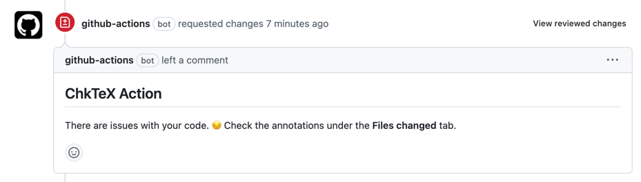
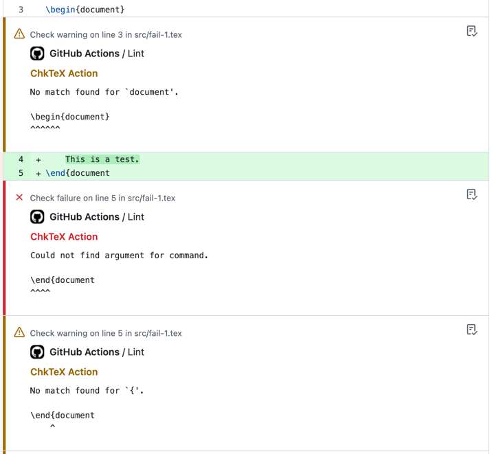
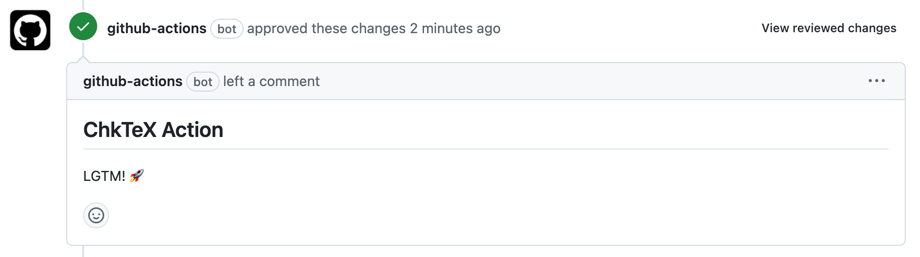
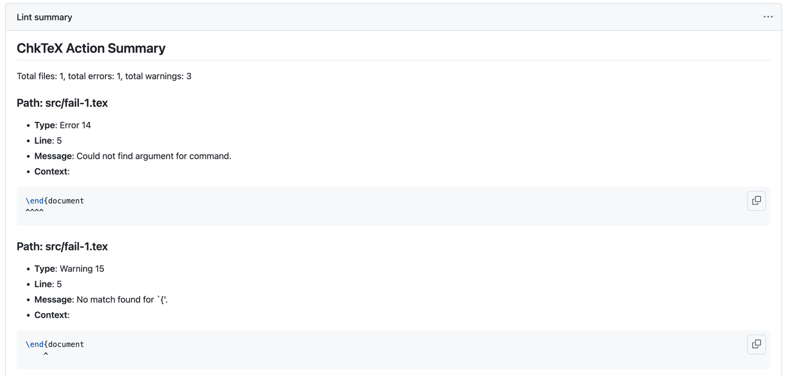

# ChkTeX Action

## _Lint your LaTeX files with ChkTeX_

[ChkTeX](https://www.nongnu.org/chktex/) is a LaTeX linter.
A _linter_ is a program that checks your work for potential stylistic or formatting issues.
For LaTeX, this includes soft errors (e.g., missing braces or alignment problems) and choices that could lead to
rendering inconsistencies.

This Action runs ChkTeX version `1.7.9` on `.tex` files in your repository.

To customize ChkTeX's behavior, add a `.chktexrc` configuration file to your repository's root.
This file allows you to define specific rules and exclusions for the linter.
Refer to the ChkTeX documentation for details on how to create and configure this file.
If no local repository `.chktexrc` file can be found, the action will use the global ChkTeX configuration distributed as
part of the ChkTeX software that runs in the Action container.

**ChkTeX Action** reviews your pull requests when used with the `pull_request` event.
If ChkTeX reports errors or warnings, the Action will request changes:



When this happens, the files changed will be annotated with the error and warning messages from ChkTeX:



Once you fix all the issues and trigger the Action again, the Action will approve your pull request:



**ChkTeX Action** also posts a step summary under `Actions > [workflow run] > Summary`:



## Configuration and Usage

To use this Action in your repository, add it to your custom workflow.

By default, the Action will only lint the files in the latest pushed commit when used with the `push` event.
If you want to override this behavior, set `lint-all: true` to lint all `.tex` files in your repository.

When used with the `pull_request` event, the Action only lints the `.tex` files that are part of the pull request.

### Events

- `push`: Lints `.tex` files in the latest pushed commit.
- `pull_request`: Lints `.tex` files that are part of the pull request.

### Permissions

- For the `push` event, set:
    - `contents: read`
- For the `pull_request` event, set:
    - `pull-requests: write`
    - `checks: write`
    - Additionally, enable `Allow GitHub Actions to create and approve pull requests` under
      `Repository > Settings > Actions > General > Workflow permissions`

### Inputs

- `lint-all`: Force lint of all files in the repository.
    - Default: `false`

### Example

```yml
name: Lint
on: push # Or `pull_request`
permissions:
  contents: read
  pull-requests: write # When using the `pull_request` event
  checks: write # When using the `pull_request` event
jobs:
  lint:
    name: Lint
    runs-on: ubuntu-latest
    steps:
      - name: Checkout
        uses: actions/checkout@v4
      - name: Run ChkTeX
        uses: j2kun/chktex-action@v2
        with:
          lint-all: true # Default: `false`
```
